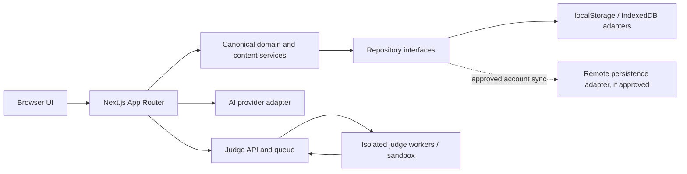

# Target Architecture

## Proposed shape

Keep a modular Next.js application for the web experience and its ordinary server-side integrations. Establish canonical domain contracts and isolate data access behind repositories/services. Add separately operated services only for responsibilities that need distinct trust, scaling, or lifecycle boundaries, especially remote code execution.

The Next.js application server handles authenticated requests, domain validation, content delivery, and orchestration. It never runs learner code. Judge workers receive only the minimum versioned problem/test package and source needed for one ephemeral execution; they have no application credentials, user document access, network access, shared mutable workspace, or host mount.

## Layers and ownership

1. **Presentation (`app/`, `components/`)**: route composition, Server Components, accessible client islands, localized UI. No direct storage/vendor access from feature components.
2. **Application services (`lib/<feature>/`)**: use cases such as retrieve lesson, submit solution, import Library item, build Atlas projection, request AI explanation, or search visible entities.
3. **Domain contracts (`lib/domain/` or the approved M2 structure)**: Concept IDs, typed relationships, validation, domain rules, and versioned use-case input/output types. Keep pure where practical.
4. **Content adapters (`content/` initially)**: authored registries and current compatibility mappings. Later content source changes do not leak to UI.
5. **Repository/provider adapters**: local storage, IndexedDB, optional remote persistence, Gemini, search engine, and judge queue. External SDKs stay behind these modules.
6. **Isolated execution service**: separate security and operational boundary. No import path from UI/server application code executes submitted source.

Avoid a generic framework for every layer. Create an interface when there are multiple implementations, an external boundary, a security/privacy boundary, or a migration seam with real value.

## Runtime composition

- Public static authored content remains server-resolvable. Detail routes validate IDs and render metadata/content server-side.
- Client islands receive only the minimum public or owner-authorized view data required for interaction. Do not serialize secrets, hidden cases, or private Library bodies into route props.
- Browser-local workflows remain useful with no account or network. If cloud sync is introduced, define explicit anonymous/local behavior and observable sync status.
- API handlers remain thin: request validation, session/authorization, idempotency/rate policy, application service call, typed response.
- Long-running work (judge runs, future document extraction/embedding) is asynchronous and status-bearing. The app server enqueues or polls; it does not hold an unbounded request open.

## Identity, data, and deployment decisions still open

There is no evidence in the repository selecting an authentication provider, hosted database, ORM, object store, queue, search service, or judge provider. Do not name one as an architectural commitment in implementation until requirements cover account model, data region, cost, retention, encryption, backup, developer operations, scale, and export/deletion.

The initial target can continue content registries and IndexedDB while M2-M5 land. A relational database is a plausible future fit for canonical entities, typed relations, accounts, and user evidence, but is not a prerequisite or decided vendor. File/object storage, queue, and search indexing should be evaluated separately from metadata storage.

## Boundaries and contracts

- `ConceptRepository`: look up by stable ID/alias, enumerate visible concepts, query typed relations.
- `ContentRepository`: resolve lesson/course/reference/problem/resource metadata and authored payload versions.
- `UserLearningRepository`: get/append/update owner-scoped evidence, goals, and plans.
- `LibraryRepository`: create/update/list/delete item metadata and binary references, export/import, future sync.
- `SearchService`: retrieve only records visible to the current principal/anonymous scope.
- `AIContextProvider`: resolve explicitly selected contexts to bounded source excerpts; never reach directly into arbitrary storage.
- `JudgeClient`: create/cancel/get submission status and fetch authorized result. It accepts code and problem/version/language, not access to app database credentials.
- Provider/service contracts use typed stable errors, bounded requests, timeouts, and idempotency where a retry can duplicate work.

## Failure and observability behavior

Every adapter translates provider errors to domain-safe codes. User interfaces distinguish offline/local success from remote pending/error. Retry policies are explicit and idempotent. Logs record correlation IDs, service outcome, latency, and coarse reason codes; source code/document text/prompts/auth tokens are excluded by default. Judge execution gets a dedicated audit policy that balances abuse investigation against source privacy.

## Migration path

**Current state:** one Next app plus browser repositories; local public-test Worker; Gemini and link-preview route handlers.

**Proposed state:** same application boundary, canonical domain layer and repository interfaces, optional remote persistence, explicit AI context providers, separate asynchronous Judge service.

**Migration path:** keep current routes and stores; build adapters around them; migrate records/relations by stable IDs; add remote services only after M6/M9/M11 decisions and threat review. A service split or framework rewrite is not a prerequisite for CS-Atlas 2.0.
