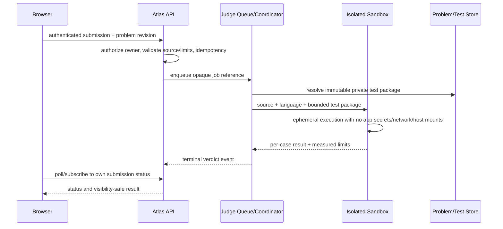

# Online Judge Architecture

## Current boundary

Current Practice is a local public-test runner, not an Online Judge. The browser receives public JSON cases and executes JavaScript inside QuickJS WASM in a disposable Worker. Python has an editor/starter and draft persistence but no execution runtime. Reference solutions are marked server-only and used by tests. Submit is disabled. Browser data can be edited and is not an authoritative score.

The current isolation is meaningful for local bounded practice, but has not been independently security audited. It does not provide secret cases, service-side resource authority, user identity, or competition-grade verdict guarantees.

## Mandatory security rule

**Untrusted user code MUST NEVER execute directly inside the main application server process.** It must never run in a Next.js API route, a regular shared server worker, host `eval`/`Function`, or a process that has application secrets, user database credentials, Library files, or unrestricted network access.

Do not enable remote Submit until a separate execution boundary is designed, independently reviewed, and operated. Default Docker settings alone are not sufficient evidence of isolation.

## Proposed components



Required logical interfaces:

```ts
interface JudgeClient {
  submit(input: { ownerId: string; problemId: string; problemVersion: number; languageId: string; source: string; idempotencyKey: string }): Promise<{ submissionId: string; status: "queued" }>;
  getStatus(ownerId: string, submissionId: string): Promise<SubmissionStatus | null>;
  cancel(ownerId: string, submissionId: string): Promise<CancelResult>;
}
```

The public Next route authenticates/authorizes and enqueues; it does not execute. The queue/coordinator retrieves immutable tests server-side and sends the minimum data to the isolated runtime. Source/test handling and result persistence follow explicit retention/access rules.

## Core entities

- `Problem` and immutable `ProblemRevision`: statement, constraints, supported language IDs, tags/rating, public examples, references to private test package, editorial/solution visibility, canonical concept links.
- `Submission`: owner, problem revision, language/runtime image version, source reference/hash, idempotency key, state, timestamps, cancellation request, retention expiry.
- `JudgeEvent`: queued/running/case result/terminal event with correlation IDs, measured CPU/wall/memory/output, safe diagnostic, judge image/version.
- `TestSuite`: public vs private visibility; immutable case IDs and package checksum. Never serialize private suite into client code or ordinary public responses.
- `LanguageRuntime`: language identifier, compiler/interpreter image digest, compile/run commands, limits, supported status.

Verdicts: `AC` accepted; `WA` wrong answer; `TLE` time limit; `MLE` memory limit; `RE` runtime error; `CE` compile error. Keep `queued`, `running`, `cancelled`, `system-error`, and unavailable states outside the verdict enum. A malformed package/worker outage is not a learner RE.

## Isolation and operations requirements

- Disposable per-job/per-run sandbox or equivalently reviewed isolation boundary; destroy filesystem and process state after execution.
- No network egress, metadata services, host mounts, application credentials, cloud role credentials, shared secrets, or cross-job writable state.
- Enforce CPU/wall time, memory, process/thread count, file size, disk quota, output bytes, syscall/capability policy, and cancellation from outside the guest.
- Compiler/runtime images are pinned, patched, minimal, and reproducibly built. Dependencies are controlled; user-supplied package installation is disabled unless separately threat-reviewed.
- Queue admission, per-user/IP quotas, concurrency limits, abuse detection, retries, dead-letter handling, worker health, capacity, and backpressure are explicit.
- Hidden tests remain service-side. Return case names/counts and safe diagnostic summaries only; never return secret input or expected output.
- Independent red-team/security review and ongoing image patching are required. Record test evidence, incident process, service ownership, and kill switch.
- Minimize source retention and restrict access. Do not put raw source in general request logs or analytics.

## Language support

Languages are backend runtime capabilities, not just editor modes. Each language needs pinned runtime/compiler version, UTF-8 stdin/stdout contract, compilation phase behavior, deterministic input contract, limits, safe diagnostics, test coverage, and starter/editor UX. Unsupported means no submit control. Do not claim Python/C/C++/Java or other support until sandbox runner and conformance tests pass.

## Migration from current Practice

**Current state:** `JudgeRunner` interface is browser-local and public-only; local verdicts are `accepted`, `wrong-answer`, runtime/time/output/resource errors, unavailable/cancelled. QuickJS runs client-side; only Gemini feedback has a server endpoint.

**Proposed state:** split `PracticeRunner` (local public cases) from a remote `JudgeClient`/Submission API. Keep verdict provenance and scope explicit so local `accepted` is never displayed as hidden-test AC.

**Migration path:** retain current Worker unchanged; define Problem revisions and remote contracts; implement mocked queue state and UI; threat-model/independently review infrastructure; deploy isolated service separately; run shadow/conformance/adversarial checks; enable Submit behind a feature gate only when all gates pass. Existing attempts remain local/public-only and are not uploaded without explicit consent.

## Risks and gates

Primary risks are sandbox escape, resource exhaustion, network/cloud metadata access, hidden test leakage, source privacy, queue abuse, image supply-chain compromise, confusing system error with learner verdict, and mislabeling public tests. M6 may define interfaces and UI without enabling execution. M14 security review is a release gate for any active judge.
